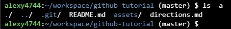
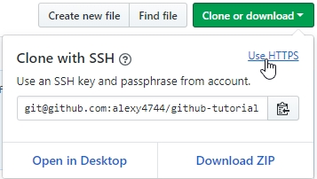
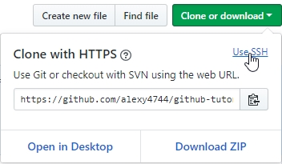
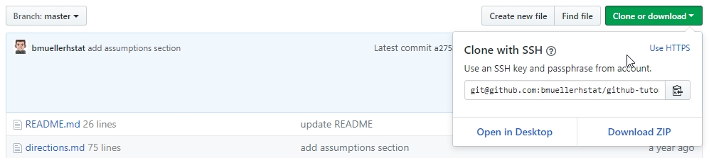
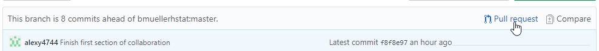
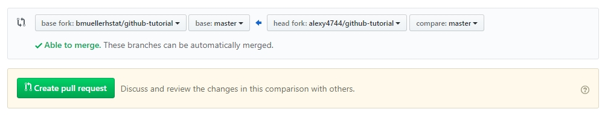

# GitHub Tutorial by [Alex](https://github.com/alexy4744)

## Git vs. GitHub

Git allows for version control of your files. It allows you to save snapshots (commits) of your files throughout different file changes. Git does not depend on GitHub.

GitHub, on the other hand, is a remote repository. It ***requires*** Git (unless you want to upload files manually). GitHub allows you to create remote repositories, where you can use Git to push your commits to a remote repository. Because it is a remote repository, it allows for collaboration with multiple people.

---
## 🌈 Creating your local repository

First, if you haven't created a directory, type `mkdir FOLDERNAME`  

Now, `cd` into your folder and type `git init`, assuming you already have Git installed

To verify whether Git has been successfully initialized in the correct directory, you can use `ls -a` to view all files/folders

You should see a hidden folder called `.git` in your working directory.  


This means that Git has sucessfully set up your local repository

---
## 🌈 Creating your remote repository.

If you do not have a GitHub account, create one [**here**](https://github.com/join?source=header-home)

After that, you can click [**here**](https://github.com/alexy4744?tab=repositories) to view all your repositories *(or click on your avatar and click "Your Repositories" in the dropdown)*.

You should see a green button called **New** on the upper right side of your screen.  


Now enter your repository name, it **should** match the name of your local repository. Then click on "Create Repository".

Now, you have both your local and remote repositories created.

---
## 🔗 Connecting your local and remote repository
For every new remote and local repository created, we need to establish a connection between them in order to push commits to your remote from the local.

**There are 2 ways of establishing a connection.**
1. **SSH**  
    * ***NOTE: This should only be done once unless you need to add more SSH keys***

    * In order to establish a SSH connection with between our local and remote, we first need to get a SSH key from our IDE.

    * Each IDE varies, but in order to get one from Cloud9, we can go [**here**](https://c9.io/account/ssh) and copy the first public SSH key for public repositories, or the second one for private repositories.  
    
    
    * We can then add the SSH key into our GitHub account  [**here**](https://github.com/settings/ssh/new), then add a title and paste the key in, then click on "**Add SSH Key**".
   
    * Now go back to your repository and copy the SSH url.  
    

2. **HTTPS**
    * ***NOTE: HTTPS requires you to sign in to GitHub, unless you have some sort of credential manager that allows Git to save and remember your credentials.***
    
    * In order to get the HTTPS url for your repository, simply copy the HTTPS url.  
    

After we have copied the URL (HTTPS or SSH) for our remote repository, we can go back in to our terminal, and `cd` into our working directory if you are already not in it.

To tell Git to connect to a remote, type `git remote add origin <URL>`, where \<URL> is the URL you copied...

> `remote` basically means remote repository.  
  `add` tells Git to *add* a new remote for this local repository.  
  `origin` is the nickname we will refer to as the remote repository URL. This can be changed to be whatever you like.

To check if our connection has been successfully added, type `git remote -v`, where the `-v` flag means *verbose*, which will show all of our remotes.

Git should output something similar to this:
* **SSH**
  ```bash
  origin  git@github.com:<USERNAME>/<REPOSITORY NAME>.git (fetch)
  origin  git@github.com:<USERNAME>/<REPOSITORY NAME>.git (push)
  ```
* **HTTPS**
  ```bash
  origin  https://github.com/<USERNAME>/<REPOSITORY NAME>.git (fetch)
  origin  https://github.com/<USERNAME>/<REPOSITORY NAME>.git (push)
  ```

---
## 🌊 Workflow & Commands

Once we have edited our files and want to push to our remote repository, here are the following commands you can follow.

The Git workflow basically consists of edit => add => commit => push.

1. **Edit your files.**

2. **Adding/removing files to the stage.**

    The staging area is basically where you can prepare what files should be committed or not. You can add or remove file(s) from the stage.
   
    To view the current files that are on the stage, type `git status`. If files have been modified and not been added on to the stage, it will show `modified: FILENAME.md` in red.
   
    To add specific file(s) onto the stage, type `git add FILENAME.md`. This will add one single file onto the stage. You can attach more file names after the first one to add multiple specfic files.
   
    To add **ALL** unstaged files onto the stage, type `git add .`.
   
    To remove specific file(s) from the stage, type `git checkout FILENAME.md`. As with `git add`, you can always add extra file names to remove multiple files from the stage at once. Removing files from the stage **WON'T** delete our files in our working directory.
   
    Once we have added our files onto the stage, you can verify them by running `git status` again. The files highlighted in green should reflect the files that we have added onto the stage with `git add`.
  
3. **Commiting files on our stage.**  

    Once we have our files added onto the stage, we can now commit those files. Commiting simply means taking a snapshot of our files with all of our changes. We can then push these commits onto GitHub.
   
    To commit our files, we can use `git commit -m "MESSAGE"`, where the `-m` flag stands for *message*, which allows us to enter a string to be used as a commit message.
    
    Commit messages are useful for keeping track all of the changes we have done over time. In additon, commit messages should be short and concise, and also in **PRESENT** tense, not *past* tense even though it seems very tempting.
    
    To verify/ view all past commits, type `git log`. This will output all previous commits, from the newest to the o  ldest. 
    
    To exit `git log`, press "Q" on your keyboard.
    
    🎉 Tada, you have succesfully created your first commit!
    
4. **Pushing our commit to our remote repository.**

    Once we have a commit, you can push it to your remote repository.  
    Keep in mind that you can **ONLY PUSH COMMITS**, nothing else.  
    You will run into errors if you try to push with no commits.
    
    To push our commit to our GitHub repository, type `git push`.
    
    ***However***, since this is our first time pushing, we need to type `git push origin master`
    
    `origin` is basically the nickname of our remote repository's SSH/HTTPS url, while `master` simply means the master branch aka the default branch.
    
    If you want to tell Git to always push to `origin master`, we can use the `-u` flag. The `-u` flag basically means upstream,
    
    So if we run `git push -u origin master`, this will tell Git to remember so that the next time you push again, Git will automatically push to `origin master`. This is only ran once, unless you want to change the remote/branch, otherwise, you can type `git push` for any other pushes.
    
    Git should now output something similar to this in your terminal
    ```bash
    Warning: Permanently added 'github.com,192.30.253.113' (RSA) to the list of known hosts.
    Counting objects: 3, done.
    Delta compression using up to 8 threads.
    Compressing objects: 100% (3/3), done.
    Writing objects: 100% (3/3), 1.17 KiB | 1.17 MiB/s, done.
    Total 3 (delta 1), reused 0 (delta 0)
    remote: Resolving deltas: 100% (1/1), completed with 1 local object.
    To github.com:alexy4744/github-tutorial.git
    1ead3a2..b56c6a9  master -> master
    ```
    
    Now, if you go back to your GitHub repository, you should see the files that were added to the staging area; now lives in your remote repository, along with the commit messages you have set! 😎
    
    🥂 Viola! You have just intergrated Git into your workflow!
    
---
## ↪ Rolling Back Changes


---
## 💑 Collaboration

GitHub allows for collaboration with multiple people. You can submit pull requests to a repository to merge your changes to the original repository. You can also be invited to be added as a contributor to a repository and have full push access without forking/cloning.

[**Fork**](https://help.github.com/articles/fork-a-repo/) - Create a copy of a remote repository to your account. You will have full push access to the forked repository as it is under your GitHub account. It will **NOT** create a local repository (that's where cloning comes in).
  
[**Clone**](https://help.github.com/articles/cloning-a-repository/) - Create a local repository from a remote repository, basically "cloning" the remote to your working directory. 
  
You can clone anyone's remote repository, however, if you are not a invited contributor, or if its not owned by you, you will not have permissions to push to it.
  
* When you clone a repository, you do not need to follow any steps mentioned in:
  * Setting up your local repository
  * Creating your remote repository
  * Connecting your local and remote repository
      
   Git will take care of those steps for you.
      
[**Pull Request**](https://help.github.com/articles/about-pull-requests/) - A request to merge your forked repository with the original repository. Pull requests can be accepted/denied by moderators.

#### Fork/Clone/Pull Request
* This method is used when you are not an invited contributor, meaning you don't have direct push access just by adding it to your remote in Git.

1. First we need to fork the original repository. To fork the repository, press on the ***fork*** button on the upper right hand corner.  
  

2. After it has been forked, GitHub will redirect you to the forked repository under your account name. We can now copy the repository URL to clone it. Click on the green ***Clone or download*** button and copy either the SSH/HTTPS url.  


3. Go back to your terminal and type `git clone <URL>`, where `<URL>` is the link you just copied.

4. Once it has finished cloning, you can do the same Git workflow mentioned in the **🌊 Workflow & Commands** section, which is edit => add => commit => push.
5
---
##### Pull requests
* ***NOTE: You don't have to submit a pull request for everytime you fork/clone, its completely optional. For example, if you want to just have a personal version of a repository with your personal edits for you own uses, it wouldn't make sense to submit a pull request.***

Once you have pushed all the changes you wish, we can submit a *pull request* to merge our forked repository with the original repository.

To submit a pull request:
  1. Click on the ***Pull request*** button in your forked repository.  
      

  2. You should now be redirected to this page, where you can compare changes  
         
    
      Hopefully, it should say ***Able to merge. These branches can be automatically merged.***

      If you have a merge conflict,which basically means that GitHub cannot automatically merge the 2 repos because of conflicting changes, you would need to [**resolve**](https://help.github.com/articles/resolving-a-merge-conflict-using-the-command-line/) them.
      
      Otherwise, click on the big green button called ***Create pull request*** and enter the title and description.
      
  3. From here, it is completely dependent whether reviewers will accept or deny your pull request. If it is accepted, your changes will be added into the original repository. If it is denied, basically nothing will happen.